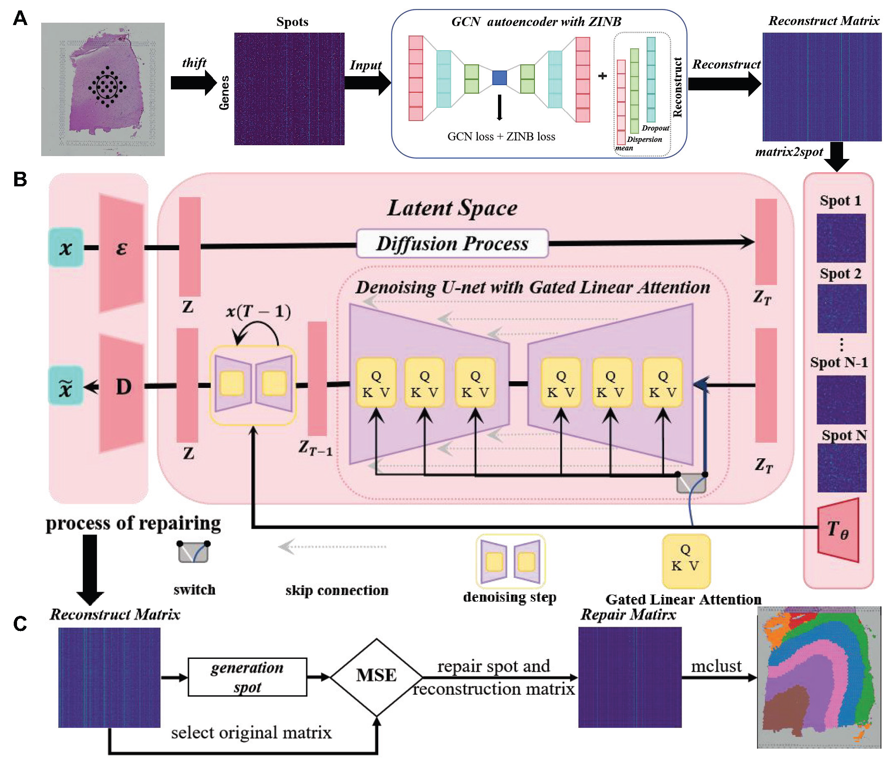

````markdown
# TOGAR: Installation Guide

TOGAR is a gated diffusion framework for spatial transcriptomics analysis, which adopts a two-stage architecture: first, it denoises gene expression profiles through GCN combined with ZINB loss, then uses a diffusion model incorporating gated linear attention and rotary positional encoding to refine the data, and finally averages the refined data with the denoised data to form the final gene expression profile data.

It mainly addresses issues such as sparsity and inaccurate spatial domain identification in spatial transcriptomics data, improves the accuracy of cell clustering, can better capture long-range spatial dependencies and spatial expression patterns of genes, and provides support for the analysis of tissue microenvironments and other related fields.

This document provides the environment setup and installation steps for TOGAR.

---

## 1. Environment Preparation

Create a dedicated Conda environment for TOGAR:

```bash
# Create environment with Python 3.8
conda create -n TOGAR python=3.8 -y

# Activate the environment
conda activate TOGAR

````

---

## 2. Dependencies Installation

Install required packages via Conda and pip:

### Conda Packages

```bash
# Install system-level dependencies
conda install conda-forge::gmp
conda install conda-forge::pot

# Install PyTorch with CUDA support (CUDA 11.8)
conda install pytorch torchvision torchaudio pytorch-cuda=11.8 -c pytorch -c nvidia
```

### Pip Packages

```bash
pip install scanpy
pip install anndata==0.8.0
pip install pandas==1.4.2
pip install rpy2==3.5.1  # For R package integration
pip install scikit-learn==1.1.1
pip install scipy==1.8.1
pip install tqdm==4.64.0
pip install einops
```

---

## 3. R Package Installation

Install the required R package `mclust` via `rpy2`:

```python
import rpy2.robjects as robjects

robjects.r('''
    install.packages('mclust')
''')
```

---

## 4. Data Access

The data used in this study can be accessed through the following channels:

### 4.1 Supplementary Materials

Relevant data are included in the Supplementary Materials of our manuscript. Please refer to the corresponding section in the publication for detailed information and download links.

### 4.2 Google Drive

You can also directly access the data via Google Drive:
[https://drive.google.com/drive/folders/1crS8sbX12Qw-jSQd1wzqCZ4qrbPRtRdF](https://drive.google.com/drive/folders/1crS8sbX12Qw-jSQd1wzqCZ4qrbPRtRdF)

**Note**: Ensure a stable network connection to access the Google Drive link. If you encounter regional access restrictions, we recommend using a VPN service compliant with local laws and regulations, or reach out to the corresponding author for alternative data transfer solutions (e.g., WeTransfer, Baidu Cloud, etc.).

---

## 5. Version Selection: Standard vs. Accelerated

We have integrated both **Standard Version** and **Accelerated Version** into a single file `repair_model_combine.py` to provide flexible options for different scenarios.

### 5.1 Version Characteristics

* **Accelerated Version (Default)**: Utilizes a "training-inference decoupling" paradigm with global model sharing and batch processing, achieving 12-15× speedup while maintaining high performance. Recommended for large-scale datasets and exploratory analysis.

* **Standard Version**: Employs personalized training for each spot with independent model parameters, providing the highest accuracy through fine-grained denoising. Recommended for small-scale datasets requiring precise biological interpretation.

### 5.2 How to Switch Between Versions

#### Step 1: Modify the Import Statement

In your `test1.ipynb` file, change the import statement:

```python
# Original import (if applicable)
from repair_model import main_repair

# New import for version selection
from repair_model_combine import repair
```

#### Step 2: Set the Version Parameter

Use the `set_speed` parameter to select your desired version:

```python
# Use Accelerated Version (GPU-based, default)
repair(..., set_speed='GPU')

# Use Standard Version (CPU-based)
repair(..., set_speed='CPU')
```

### 5.3 Usage Recommendations

| Scenario                          | Dataset Size   | Recommended Version                     | Expected Runtime |
| --------------------------------- | -------------- | --------------------------------------- | ---------------- |
| Precise biological interpretation | < 5,000 spots  | Standard Version (`set_speed='CPU'`)    | 3-5 hours        |
| Exploratory analysis              | > 5,000 spots  | Accelerated Version (`set_speed='GPU'`) | 15-20 minutes    |
| Ultra-large spatial atlas         | > 20,000 spots | Accelerated Version (`set_speed='GPU'`) | 1-2 hours        |

**Note**: The Accelerated Version is set as the default option. For datasets with fewer than 5,000 spots where maximum accuracy is critical, we recommend switching to the Standard Version.

---

## 6. Runtime Benchmarks

The following table presents the runtime comparison between the Standard Version and Accelerated Version across various datasets. All tests were conducted on the same hardware configuration (detailed specifications available in the repository).

| Dataset              | Spots  | Genes  | Standard Version | Accelerated Version | Speedup |
| -------------------- | ------ | ------ | ---------------- | ------------------- | ------- |
| 151507               | 4,226  | 33,538 | 3h 51min         | 17min               | ~13.6×  |
| 151508               | 4,384  | 33,538 | 3h 53min         | 18min               | ~13.0×  |
| 151509               | 4,789  | 33,538 | 4h 20min         | 19min               | ~13.7×  |
| 151510               | 4,634  | 33,538 | 4h 16min         | 19min               | ~13.5×  |
| 151669               | 3,661  | 33,538 | 3h 17min         | 15min               | ~13.1×  |
| 151670               | 3,498  | 33,538 | 3h 13min         | 14min               | ~13.8×  |
| 151671               | 4,110  | 33,538 | 3h 49min         | 16min               | ~14.3×  |
| 151672               | 4,015  | 33,538 | 3h 42min         | 16min               | ~13.9×  |
| 151673               | 3,639  | 33,538 | 3h 19min         | 15min               | ~13.3×  |
| 151674               | 3,673  | 33,538 | 3h 13min         | 15min               | ~12.9×  |
| 151675               | 3,592  | 33,538 | 3h 20min         | 14min               | ~14.3×  |
| 151676               | 3,460  | 33,538 | 3h 06min         | 14min               | ~13.3×  |
| Human Breast Cancer  | 3,798  | 36,601 | 4h 07min         | 16min               | ~15.4×  |
| CID4465              | 1,211  | 17,957 | 1h 12min         | 6min                | ~12.0×  |
| E9.5_E2S2            | 4,356  | 24,107 | 5h 14min         | 18min               | ~17.4×  |
| E9.5_E2S3            | 5,059  | 24,238 | 6h 01min         | 21min               | ~17.2×  |
| Mouse Olfactory Bulb | 21,724 | 21,220 | 19h 50min        | 1h 20min            | ~14.9×  |

**Key Observations:**

* The Accelerated Version achieves **12-17× speedup** across all datasets while maintaining comparable performance
* For ultra-large datasets (>20,000 spots), the acceleration effect is particularly significant
* Average runtime reduction: from **3.5-4 hours** to **15-20 minutes** for standard-sized datasets
GPU -------  RTX 4080Super (32G)
---

## 7. The Workflow of TOGAR



---

**For questions or issues, please contact the corresponding author or open an issue in the GitHub repository.**
